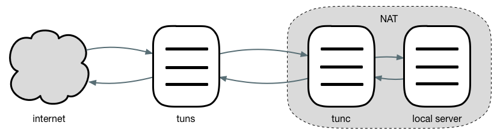

# tun

[](https://travis-ci.org/4396/tun)

### Introduction

This is a simple and efficient reverse proxy toolkit that expose servers behind a NAT to the internet, such as accessing local web server via the internet.



### Usage

Developers can import tun packages to develop their own programs, import `github.com/4396/tun/server` development server program, import `github.com/4396/tun/client` development client program. 

The server program need to implement authentication and load function, prototype as follows.

```go
// AuthFunc using id and token to authorize a proxy.
type AuthFunc func(id, token string) error

// LoadFunc using loader to load a proxy with id.
type LoadFunc func(loader Loader, id string) error
```

At the same time the project also provides a default implementation, located in the `github.com/4396/tun/cmd`, support tcp and http two types of proxy.

```shell
~ go get github.com/4396/tun/cmd/tuns
~ go get github.com/4396/tun/cmd/tunc
```

For example, expose the local godoc service to internet.

1. Start godoc:

    `godoc -http=:9090`

2. Start tuns:

    `./tuns -c tuns.ini`

    ```ini
    # tuns.ini
    [tuns]
    addr = ServerIP:7000 # or :7000
    http = ServerIP:7070 # or :7070

    [godoc]
    type = http
    token = hello
    domain = godoc.mydomain.com
    ```

2. Start tunc:

    `./tunc -c tunc.ini`

    ```ini
    # tunc.ini
    [tunc]
    server = ServerIP:7000

    [godoc]
    addr = 127.0.0.1:9090 # or :9090
    token = hello
    ```

    Or do not use a configuration file:

    `./tunc -server=ServerIP:7000 -id=godoc -token=hello -addr=:9090`

4. Resolve A record of `godoc.mydomain.com` to `ServerIP`.

    *If there are many proxies, you can resolve wildcard domain name.*

5. Use nginx, not necessary.

    ```nginx
    server {
        listen       80;
        server_name  godoc.mydomain.com;
        
        # wildcard domain name
        # server_name  ~.mydomain.com;
        
        location / {
            proxy_pass http://localhost:7070;
            proxy_set_header Host $host;
        }
    }
    ``` 

### Reference

- ngrok - https://github.com/inconshreveable/ngrok
- frp - https://github.com/fatedier/frp
